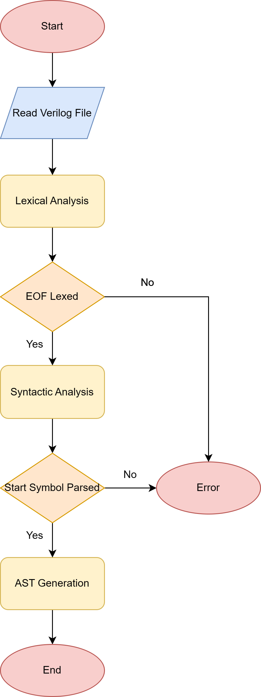
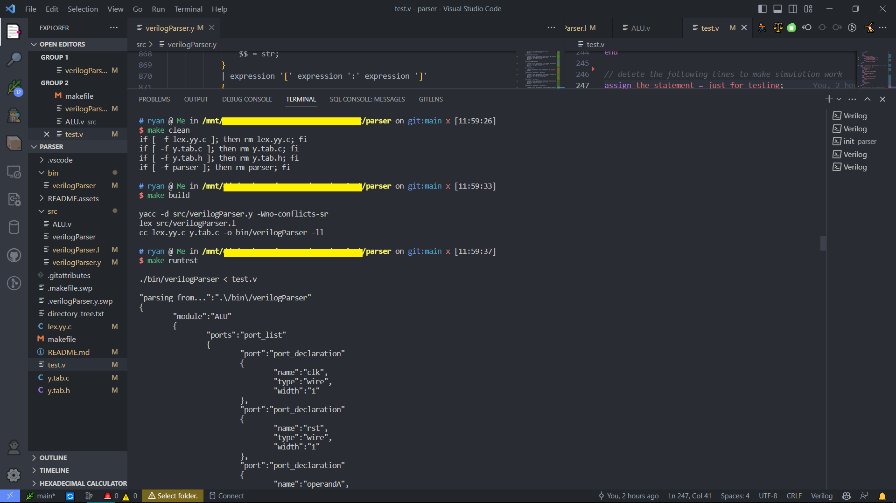
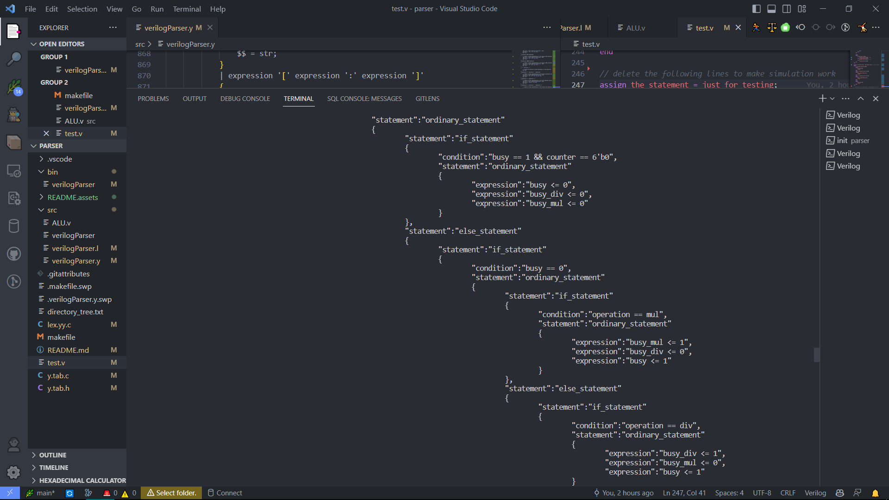
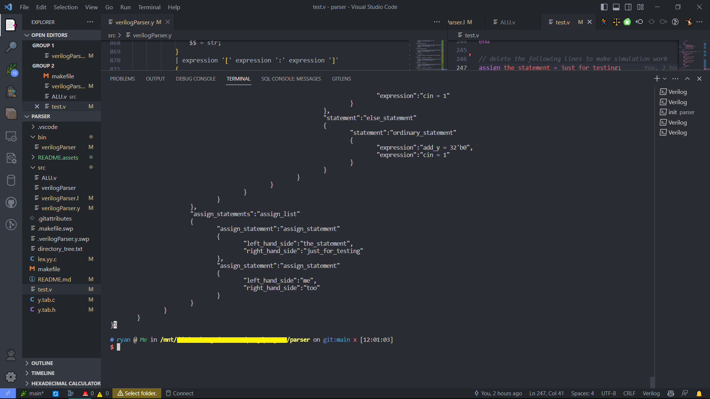

# 					Parser of Verilog Using Lex/YACC


 

**Department of Electrical Engineering and Computer Science**

**COSC320- Concepts of Programming Languages**

**PROJECT4 _Spring 2023**

**Parsing of input languages using lex/ yacc**


> Tao Wei (100063849)
>
> Available at: [Ryan-Wei/VerilogParser: a simple verilog parser (github.com)](https://github.com/Ryan-Wei/VerilogParser)


## 1. Introduction

#### 1.1 Motivation

In this course project, I will construct a **parser of Verilog** using YACC and an associated lexer using Flex for the following reasons:

- I would want to select a project that relates to compiling because I will transfer the credits from this course to *fundamentals of compiling* in my home school; 
- Verilog is a programming language that I am extremely familiar with because I once used it to design a pipeline CPU based on MIPS instruction set.

#### 1.2 Problem Description

The primary objective of this project is to develop a Verilog parser capable of analyzing Verilog code and constructing a hierarchical representation of the code's structure. The parser should utilize the lex/yacc (Flex/Bison) toolset, which enables the generation of efficient and accurate parsers from lexical and grammatical specifications. The Verilog parser should be able to handle a broad range of Verilog constructs, including module declarations, ports, statements, expressions, and control structures. By implementing a robust Verilog parser, we can lay the foundation for various language processing tasks such as code generation, optimization, and static analysis.

#### 1.3 Domain Introduction

In the field of digital design and hardware description languages, Verilog stands as a widely adopted and standardized language for modeling and simulating digital systems. As Verilog designs grow in complexity, the need for efficient tools to analyze, validate, and transform Verilog code becomes crucial. Parsing, a fundamental process in language processing, plays a key role in understanding and interpreting the structure and syntax of programming languages. In this project, I aim to implement a Verilog parser using lex/yacc, also known as Flex/Bison, to facilitate the analysis and manipulation of Verilog code.

#### 1.4 Project Scope

The project will focus on the design and implementation of a Verilog parser using the lex/yacc system. The parser will take its input from Verilog source code files and generate an abstract syntax tree (AST) in `json` format representing the hierarchical structure of the code. The parser will handle the tokenization of Verilog constructs, enforcing the language's syntax rules and identifying any syntactic errors. While semantic analysis and detailed error handling are important aspects of Verilog parsing, they may not be the primary focus of this project, which primarily aims to construct a functional Verilog parser.

#### 1.5 Expected Deliverables

The main deliverable of this project will be a Verilog parser implemented using lex/yacc. Along with the parser implementation, a comprehensive project report will be provided, encompassing the problem statement, detailed notes on the parser description, flow chart illustrating the program implementation, program codes with line-by-line comments, screenshots of the parser's results, a concluding analysis, and a list of references used.


## 2. Notes

#### 2.1 Verilog

Verilog is a hardware description language (HDL) widely used in the design, simulation, and verification of digital electronic systems. It provides a concise and structured way to describe the behavior and structure of digital circuits at various levels of abstraction. Verilog is particularly popular in the field of electronic design automation (EDA) and is an industry-standard language for digital circuit design.

As a modern programming language, Verilog has a rich and intricate syntax. Since a finished Verilog parser would need thousands of lines of code, this project will merely implement the most frequently used syntax that are essential for describing digital circuits, and generate the input Verilog text file's Abstract Syntax Tree (AST).

Here are some of the most frequently used Verilog syntax elements supported by this project:

1. Module Declaration:

   ```verilog
   module module_name (input_list, output_list);
       // Module body
   endmodule
   ```

   Modules are the building blocks of Verilog designs. They encapsulate a set of logic and define input and output ports.

2. Data Types:
   Verilog supports various data types, including:

   - `wire`: Represents a continuous signal or interconnect.
   - `reg`: Represents a storage element or a variable as a register.
   - `integer`, `real`, `time`, and other predefined data types.

3. Port Declarations:
   Ports define the interface of a module and specify its inputs and outputs. They can be declared as `input`s, `output`s, or bidirectional.

   ```verilog
   module module_name (input wire a, output reg b, inout wire [7:0] c);
   ```

4. Assignments:
   Assignments are used to assign values to signals or variables.

   - Blocking assignment (`=`): Executes in sequence.
   - Non-blocking assignment (`<=`): Executes concurrently.

   ```verilog
   a = b;
   c <= d;
   ```

5. Operators:
   Verilog provides various operators for performing arithmetic, bitwise, logical, and comparison operations. Some commonly used operators include `+`, `-`, `*`, `/`, `%`, `&`, `|`, `^`, `!`, `~`, `==`, `!=`, `>`, `<`, `>=`, `<=`, `&&`, `||`, etc.

6. Behavioral Statements:
   Verilog supports behavioral constructs to describe the behavior of circuits.

   - If-else statement:

     ```verilog
     if (condition)
         // Statements
     else
         // Statements
     ```

   - Case statement:

     ```verilog
     case (expression)
         value1: // Statements
         value2: // Statements
         default: // Statements
     endcase
     ```

7. Procedural Blocks:
   Procedural blocks define a sequence of statements executed sequentially or concurrently.

   - Always block:

     ```verilog
     always @(posedge clk)
         // Statements
     ```

   - Initial block:

     ```verilog
     initial
         // Statements
     ```

8. Hierarchical Instantiation:
   Verilog allows hierarchical instantiation of modules within other modules.

   ```verilog
   module top_module;
       module sub_module_1 (inputs, outputs);
       module sub_module_2 (inputs, outputs);
       // ...
   endmodule
   ```

9. Comments:
   Verilog supports both single-line and multi-line comments for adding notes and explanations to the code.

   ```verilog
   // This is a single-line comment
   /* This is a
      multi-line comment */
   ```

#### 2.2 Lexer

The lexer (lexical analyzer) in Verilog is responsible for breaking down the input Verilog source code into a sequence of tokens or lexemes. Its main function is to scan the input characters and identify the different components of the code, such as keywords, identifiers, operators, numbers, and punctuation symbols. The lexer serves as the initial phase in the Verilog compilation process and plays a crucial role in preparing the code for further analysis by the parser.

Here are some key functions and features of the lexer in Verilog:

1. **Tokenization**: The lexer scans the input Verilog code character by character and identifies the individual tokens or lexemes. It recognizes keywords (e.g., `module`, `input`, `output`), identifiers (module names, signal names), operators (arithmetic, bitwise), numbers (integer, real), punctuation symbols (brackets, semicolons), and other language elements.
2. **Skipping Whitespace and Comments**: The lexer ignores whitespace characters (spaces, tabs, newlines) and discards them as they do not affect the code's structure. It also handles comments (single-line or multi-line) and removes them from the token stream.
3. **Token Attributes**: Each token identified by the lexer may have associated attributes. For example, a number token may include attributes like its value and data type, while an identifier token may include attributes like its name and scope.
4. **Interface with Parser**: The lexer provides a stream of tokens to the parser, which is responsible for syntactic analysis. The parser uses the tokens to build the abstract syntax tree (AST) representing the structure of the Verilog code.

The lexer's primary role is to break down the Verilog source code into meaningful tokens, allowing subsequent stages of the compilation process to operate on well-defined language components. It provides the foundation for the parser to analyze the code's syntax and structure, facilitating the understanding and manipulation of the Verilog design.

#### 2.3 Parser

The parser in Verilog is a crucial component of the compilation process that analyzes the syntax and structure of the Verilog code. Its primary function is to parse the sequence of tokens generated by the lexer and construct a parse tree or an abstract syntax tree (AST) representing the hierarchical structure of the code.

Here are key functions and features of the Verilog parser:

1. **Grammar Rules**: The parser follows a set of grammar rules specific to the Verilog language. These rules define the syntax and structure of valid Verilog code, including module declarations, port definitions, statements, expressions, and control structures.
2. **Syntactic Analysis**: The parser analyzes the sequence of tokens to ensure they conform to the Verilog grammar rules. It verifies the correctness of the code's syntax, identifying any syntax errors or violations. If an error is found, the parser may generate appropriate error messages or diagnostics.
3. **AST Construction**: As the parser processes the tokens, it constructs an AST that represents the hierarchical structure of the Verilog code. The AST represents the relationships between different language constructs, such as modules, ports, statements, and expressions, and serves as an intermediate representation that can be further utilized for analysis, optimization, or code generation.
4. **Interface with Other Compilation Stages**: Once the parsing is complete, the parser provides the resulting parse tree or AST to subsequent stages of the compilation process, such as semantic analysis, optimization, or code generation. These stages utilize the parsed structure to perform further analysis or transformations.

Overall, the Verilog parser plays a vital role in understanding the structure and syntax of Verilog code. It ensures that the code is valid, constructs a representation of the code's hierarchy, and facilitates subsequent stages in the compilation pipeline.

#### 2.4 Lex/YACC

Lex and Yacc (or Flex and Bison) are widely used tools for creating lexical analyzers (lexers) and parsers, respectively. They are commonly used in the field of compiler construction to process and analyze programming languages.

Lex (or Flex) is a lexical analyzer generator that helps in creating lexical analyzers. A lexical analyzer, also known as a lexer or scanner, takes input source code and breaks it down into a stream of tokens. Lex helps in defining regular expressions that specify the patterns for different tokens in the input language. It generates a C or C++ code file that implements the lexer based on the provided regular expressions.

Yacc (or Bison) is a parser generator that aids in creating parsers. A parser is responsible for analyzing the syntax of a language by recognizing the hierarchical structure of the input code. Yacc uses a grammar specification, typically written in a language similar to BNF (Backus-Naur Form), to define the rules and syntax of the input language. It generates a C or C++ code file that implements the parser based on the provided grammar. Yacc (or Bison) is capable of generating both LALR (Look-Ahead LR) and LR (Canonical LR) parsers. Both LALR and LR parsers are effective for parsing programming languages and other context-free languages. 

##### 2.4.1 Grammar

Here's a breakdown of the grammar components in this project:

- `verilog_file`:

  - This is the starting non-terminal symbol for the grammar.

  - It represents a Verilog file and consists of a `module_declaration_list`.

  - After parsing the `module_declaration_list`, it calls a function `json_end_object()` to end the parsing.

- `module_declaration_list`:

  - This non-terminal symbol represents a list of module declarations.

  - It can have one or more `module_declaration` rules.

- `module_declaration`:

  - This non-terminal symbol represents the declaration of a Verilog module.

  - It consists of several parts, such as module name, port list, and module body.

  - After parsing the module declaration, it generates a JSON object using various functions (`json_start_object`, `json_add_string`, `json_add_number`, etc.) to represent the module and its properties.

- `port_list` and `internal_port_list`:

  - These non-terminal symbols represent lists of port declarations.

  - They define how to handle port declarations and store the information about port names, types, and widths.

- `port_declaration`:

  - This non-terminal symbol represents the declaration of a port.

  - It defines different types of ports, such as input, output, wire, or reg, with or without width specification.

- `module_body`:

  - This non-terminal symbol represents the body of a Verilog module.

  - It can contain an `internal_port_list`, `always_list`, and `assign_list`.

- `always_list`:

  - This non-terminal symbol represents a list of always blocks.

  - It can have one or more `always_block` rules.

- `always_block`:

  - This non-terminal symbol represents an always block in Verilog.

  - It defines the condition and statement block for the always block.

- `statement_block`:
  - This non-terminal symbol represents a block of statements enclosed in `begin` and `end` tokens.

- `statement_list`:

  - This non-terminal symbol represents a list of statements.

  - It can have one or more `statement` rules.

- `statement`:
  - This non-terminal symbol represents different types of statements, such as ordinary statements, if statements, and if-else statements.

- `assign_list`:

  - This non-terminal symbol represents a list of assign statements.

  - It can have one or more `assign_statement` rules.

- `assign_statement`:

  - This non-terminal symbol represents an assign statement in Verilog.

  - It defines the assignment of a value to a variable.

**Please refer to the comments in [verilogParser.y](#4.4.1 verilogParser.y) for detailed implementation**

Here is the breakdown of the specific unambiguous grammar in this project:

```yacas
verilog_file    : module_declaration_list

module_declaration_list : module_declaration
                        | module_declaration_list module_declaration

module_declaration : MODULE IDENTIFIER '(' port_list ')' ';' module_body ENDMODULE

port_list           : port_declaration
                    | port_list ',' port_declaration

internal_port_list  : port_declaration ';'
                    | internal_port_list port_declaration ';'

port_declaration   : INPUT IDENTIFIER
                    | OUTPUT IDENTIFIER
                    | INOUT IDENTIFIER
                    | WIRE IDENTIFIER
                    | REG IDENTIFIER
                    | IDENTIFIER '[' NUMBER ':' NUMBER ']' IDENTIFIER
                    | IDENTIFIER '[' NUMBER ':' NUMBER ']' IDENTIFIER '[' NUMBER ':' NUMBER ']'
                    | IDENTIFIER IDENTIFIER
                    | IDENTIFIER IDENTIFIER '[' NUMBER ':' NUMBER ']'

module_body         : { }
                    | { module_item_declaration }
                    | { module_item_declaration module_item_declaration }

module_item_declaration : port_declaration ';'
                        | net_declaration ';'
                        | reg_declaration ';'
                        | integer_declaration ';'
                        | real_declaration ';'
                        | time_declaration ';'
                        | event_declaration ';'
                        | task_declaration
                        | function_declaration
                        | continuous_assign
                        | initial_statement
                        | always_statement

net_declaration     : NETTYPE IDENTIFIER '[' NUMBER ':' NUMBER ']' IDENTIFIER ';'
                    | NETTYPE IDENTIFIER '[' NUMBER ':' NUMBER ']' IDENTIFIER '[' NUMBER ':' NUMBER ']' ';'
                    | NETTYPE IDENTIFIER IDENTIFIER ';'
                    | NETTYPE IDENTIFIER IDENTIFIER '[' NUMBER ':' NUMBER ']' ';'

reg_declaration     : REG IDENTIFIER ';'
                    | REG IDENTIFIER '[' NUMBER ':' NUMBER ']' ';'

integer_declaration : INTEGER IDENTIFIER ';'

real_declaration    : REAL IDENTIFIER ';'

time_declaration    : TIME IDENTIFIER ';'

event_declaration   : EVENT IDENTIFIER ';'

task_declaration    : TASK IDENTIFIER ';'

function_declaration: FUNCTION IDENTIFIER ';'

continuous_assign   : ASSIGN assignment_expression ';'

initial_statement   : INITIAL statement

always_statement    : ALWAYS always_keyword '(' sens_list ')' statement

always_keyword      : @*
                    | @(*)

sens_list           : sensitivity
                    | sens_list ',' sensitivity

sensitivity         : IDENTIFIER
                    | posedge IDENTIFIER
                    | negedge IDENTIFIER

statement           : blocking_assignment
                    | nonblocking_assignment
                    | if_statement
                    | case_statement
                    | loop_statement
                    | procedural_continuous_assignment
                    | disable_statement
                    | event_trigger
                    | wait_statement

blocking_assignment : variable_assignment ';'

nonblocking_assignment : variable_assignment '<=' expression ';'

variable_assignment : variable_lvalue '=' expression

variable_lvalue     : IDENTIFIER
                    | IDENTIFIER '[' expression ']'
                    | IDENTIFIER '[' expression ':' expression ']'
                    | IDENTIFIER '[' ':' expression ']'
                    | IDENTIFIER '[' expression ':' ']'

expression          : term
                    | expression binary_operator term

term                : primary
                    | term unary_operator primary

primary             : NUMBER
                    | REALNUMBER
                    | STRING
                    | IDENTIFIER
                    | IDENTIFIER '[' expression ']'
                    | IDENTIFIER '[' expression ':' expression ']'
                    | IDENTIFIER '[' ':' expression ']'
                    | '(' expression ')'

binary_operator     : '+'
                    | '-'
                    | '*'
                    | '/'
                    | '%'
                    | '=='
                    | '!='
                    | '==='
                    | '!=='
                    | '&&'
                    | '||'
                    | '<'
                    | '<='
                    | '>'
                    | '>='
                    | '&'
                    | '|'
                    | '^'
                    | '~^'
                    | '<<'
                    | '>>

```


## 3. Flow Chart



Here's a breakdown of each step:

1. **Read Verilog File**: The Verilog source code is opened and read by the lexer line by line. The file content is loaded into the program's processing buffer.

2. **Lexical Analysis**: The Verilog source code is processed by the lexer (generated using lex) to identify individual language tokens, such as keywords, identifiers, operators, numbers, and punctuation symbols.
3. **EOF Lexed**: If the curser reaches the End-of-File, the lexing operation is successful; otherwise, it is unsuccessful.

4. **Syntactic Analysis**: The tokens are passed to the parser (generated using yacc), which verifies the correctness of the code's syntax and constructs a parse tree or abstract syntax tree (AST) representing the code's structure.
5. **Start Symbol Parsed**: The parsing procedure is successful if the Start Symbol can be correctly parsed; otherwise, it fails.

6. **AST Generation**: The parser constructs a hierarchical representation of the code's structure using Abstract Syntax Tree (AST). This tree captures the relationships and dependencies between different language constructs, aiding further analysis.

7. **End**: The flow chart concludes, indicating the completion of the Verilog parser implementation.


## 4. Code

Available at:[Ryan-Wei/VerilogParser: a simple verilog parser (github.com)](https://github.com/Ryan-Wei/VerilogParser)

#### 4.1 Environment

- Software
  - Windows Subsystem for Linux (WSL) 1.2.5.0 / Ubuntu 20.04
  - bison (GNU Bison) 3.5.1
  - flex 2.6.4
  - gcc (Ubuntu 9.4.0-1ubuntu1~20.04.1) 9.4.0
  - GNU Make 4.2.1 Built for x86_64-pc-linux-gnu
  - git 2.40.1

- Hardware
  - Processor	Intel(R) Core(TM) i5-1035G4 CPU @ 1.10GHz   1.50 GHz
  - Installed RAM	16.0 GB

#### 4.2 Directory

```shell
.
├── .git
├── .gitattributes
├── .makefile.swp
├── .verilogParser.y.swp
├── .vscode
│   ├── c_cpp_properties.json
│   ├── launch.json
│   └── settings.json
├── README.md
├── bin
│   └── verilogParser
├── makefile
├── src
│   ├── ALU.v
│   ├── verilogParser
│   ├── verilogParser.l
│   └── verilogParser.y
└── test.v

```

#### 4.3 Usage

Build the project:

```makefile
make build
```

Run the project:

```makefile
make run
[input text]
[ctrl + d]
```

Run the default test file:

```makefile
make runtest
```

Run a custom test file:

````shell
cd bin
./verilog < [path of the input file]
````

Delete the generated files:

```makefile
make clean
```

Clean ,build and run:

```makefile
make all
```

#### 4.4 Source Code

##### 4.4.1 verilogParser.y

```cpp
%{
#include <stdio.h>
#include <stdlib.h>
#include <string.h>
#include <stdbool.h>
#include <math.h>

// Declare external functions
extern int yylex();
void yyerror(const char *msg);
%}

// Define the union type for semantic values
%union 
{
    // Struct for module_body
    struct module_body_t 
    {
        struct internal_port_list_t *internal_port_list; // Internal port list
        struct always_list_t *always_list; // List of always blocks
        struct assign_list_t *assign_list; // List of assign statements
    } *module_body;

    // Struct for port_list
    struct port_list_t 
    {
        struct port_t *ports; // Array of ports
        int count; // Number of ports
    } *port_list;

    // Struct for internal_port_list
    struct internal_port_list_t 
    {
        struct port_t *ports; // Array of internal ports
        int count; // Number of internal ports
    } *internal_port_list;

    // Struct for port
    struct port_t 
    {
        char *name; // Port name
        char *type; // Port type
        int width; // Port width
    } port;

    // Struct for always_block
    struct always_block_t 
    {
        char *condition; // Condition of the always block
        struct statement_t *statement; // Statement of the always block
    } always_block;

    // Struct for always_list
    struct always_list_t 
    {
        struct always_block_t *always_block; // Array of always blocks
        int count; // Number of always blocks
    } *always_list;

    // Struct for statement
    struct statement_t 
    {
        struct statement_t *head; // Head statement
        struct statement_t *tail; // Tail statement
        char *expression; // Expression of the statement
        int flag; // Flag indicating the type of statement node
        char *type; // Type of the statement
        char *condition; // Condition of the statement
    } *statement;

    // Struct for assign_list
    struct assign_list_t 
    {
        struct assign_statement_t *assign_statement; // Array of assign statements
        int count; // Number of assign statements
    } *assign_list;

    // Struct for assign_statement
    struct assign_statement_t 
    {
        char *left; // Left-hand side of the assign statement
        char *right; // Right-hand side of the assign statement
        char *type; // Type of the assign statement
    } assign_statement;

    char* strval; // String value
    int intval; // Integer value
}

// Define tokens
%token <strval> MODULE 
%token <strval> ENDMODULE 
%token <strval> INPUT 
%token <strval> OUTPUT 
%token <strval> WIRE 
%token <strval> REG
%token <strval> INTEGER
%token <strval> IDENTIFIER 
%token <intval> NUMBER
%token <strval> NUMBER_EXPR
%token <strval> BEGIN_TOKEN
%token <strval> END_TOKEN
%token <strval> ALWAYS
%token <strval> IF
%token <strval> ELSE
%token <strval> ASSIGN
%token <strval> LE
%token <strval> GE
%token <strval> EQ
%token <strval> NE
%token <strval> AND
%token <strval> OR
%token <strval> NAND
%token <strval> NOR
%token <strval> XOR
%token <strval> XNOR
%token <strval> POSEDGE
%token <strval> NEGEDGE
%token <strval> OR_WORD

// Define non-terminals
%type <port_list> port_list
%type <port> port_declaration
%type <strval> verilog_file
%type <strval> module_declaration_list
%type <strval> module_declaration
%type <internal_port_list> internal_port_list
%type <module_body> module_body
%type <always_list> always_list
%type <always_block> always_block
%type <strval> expression
%type <statement> statement
%type <statement> statement_block
%type <statement> statement_list
%type <assign_list> assign_list
%type <assign_statement> assign_statement

    
%{

// Function to print a JSON string
static void print_json_string(const char *str);

// Function to print indentation based on depth
static void print_json_indent(int depth);

// Variable to track if it's the first item in the JSON object
static bool first_item = true;

// Variable to track the depth of the JSON object
static int json_depth = 0;

// Function to print the start of a JSON object
static void print_json_object_start(int depth) 
{
    putchar('\n');
    print_json_indent(depth - 1); // Print indentation
    putchar('{');
    first_item = true;
}

// Function to print the end of a JSON object
static void print_json_object_end(int depth) 
{
    putchar('\n');
    print_json_indent(depth);
    putchar('}');
}

// Function to print indentation based on depth
static void print_json_indent(int depth) 
{
    for (int i = 0; i < depth; i++) 
    {
        putchar('\t');
    }
}

// Function to print a key-value pair in the JSON object
static void print_json_key_value(const char *key, const char *value, int depth) 
{
    if (!first_item) 
    {
        putchar(','); // Print comma if it's not the first item
    }
    first_item = false;
    putchar('\n');
    print_json_indent(depth); // Print indentation
    print_json_string(key); // Print key
    putchar(':');
    print_json_string(value); // Print value
}

// Function to print a JSON string with proper escaping
static void print_json_string(const char *str) 
{
    putchar('"');
    for (const char *p = str; *p; p++) 
    {
        switch (*p) 
        {
            case '"': printf("\\\""); break; // Escape double quote
            case '\\': printf("\\\\"); break; // Escape backslash
            case '/': printf("\\/"); break; // Escape forward slash
            case '\b': printf("\\b"); break; // Escape backspace
            case '\f': printf("\\f"); break; // Escape form feed
            case '\n': printf("\\n"); break; // Escape newline
            case '\r': printf("\\r"); break; // Escape carriage return
            case '\t': printf("\\t"); break; // Escape tab
            default: putchar(*p); break;
        }
    }
    putchar('"');
}

// Function to start a JSON object with a key-value pair
static void json_start_object(const char *key, const char *value) 
{
    print_json_key_value(key, value, json_depth++);
    print_json_object_start(json_depth);
}

// Function to end the current JSON object
static void json_end_object() 
{
    print_json_object_end(--json_depth);
}

// Function to add a string to the JSON object
static void json_add_string(const char *key, const char *value) 
{
    print_json_key_value(key, value, json_depth);
}

// Function to add a number to the JSON object
static void json_add_number(const char *key, const int value) 
{
    char str[64];
    sprintf(str, "%d", value);
    print_json_key_value(key, str, json_depth);
}

// Function to add a boolean to the JSON object
static void json_add_boolean(const char *key, bool value) 
{
    print_json_key_value(key, value ? "true" : "false", json_depth);
}

// Function to add a null value to the JSON object
static void json_add_null(const char *key) 
{
    print_json_key_value(key, "null", json_depth);
}

// Function to print a statement
static void print_statement(struct statement_t *p) 
{
    if (!p) 
        return;

    if (p->flag) 
    {
        // Print expression
        json_add_string("expression", p->expression);
        print_statement(p->tail);
    }
    else 
    {
        // Start a new statement object
        json_start_object("statement", p->type);

        if (p->condition) 
        {
            // Print condition
            json_add_string("condition", p->condition);
        }

        print_statement(p->head);
        
        // End the statement object
        json_end_object();

        print_statement(p->tail);
    }
}

%}

%%
verilog_file    : module_declaration_list
                {
                    // started by main()
                    json_end_object(); // end parsing from
                }

module_declaration_list     : module_declaration
                            | module_declaration_list module_declaration { }


module_declaration  : MODULE IDENTIFIER '(' port_list ')' ';' module_body ENDMODULE 
                    {
                        json_start_object("module", $2); // Start module object
                            //json_add_string("name", $2);
                            json_start_object("ports", "port_list"); // Start ports object
                                for (int i = 0; i < $4 -> count; i++) 
                                {
                                    json_start_object("port", "port_declaration"); // Start port object
                                    //json_add_string("tag", "port_declaration");
                                    json_add_string("name", $4 -> ports[i].name); // Add port name
                                    json_add_string("type", $4 -> ports[i].type); // Add port type
                                    json_add_number("width", $4 -> ports[i].width); // Add port width
                                    json_end_object(); // End port object
                                }
                            json_end_object(); // End ports object

                            json_start_object("module_body", "module_body"); // Start module body object
                                if ($7 -> internal_port_list) 
                                {
                                    json_start_object("internal_ports", "internal_port_list"); // Start internal ports object
                                        //printf("internal port count: %d\n", $7 -> internal_port_list -> count);
                                        for (int i = 0; i < $7 -> internal_port_list -> count; i++) 
                                        {
                                            json_start_object("port", "port_declaration"); // Start port object
                                                //json_add_string("tag", "port_declaration");
                                                json_add_string("name", $7 -> internal_port_list -> ports[i].name); // Add port name
                                                json_add_string("type", $7 -> internal_port_list -> ports[i].type); // Add port type
                                                json_add_number("width", $7 -> internal_port_list -> ports[i].width); // Add port width
                                            json_end_object(); // End port object
                                        }
                                    json_end_object(); // End internal ports object
                                }

                                if ($7 -> always_list) 
                                {
                                    json_start_object("always_blocks", "always_list"); // Start always blocks object
                                        for (int i = 0; i < $7 -> always_list -> count; i++) 
                                        {
                                            json_start_object("always_block", "always_definition"); // Start always block object
                                                json_add_string("condition", $7 -> always_list -> always_block[i].condition); // Add always block condition
                                                json_start_object("statement", $7 -> always_list -> always_block[i].statement -> type); // Start statement object
                                                    print_statement($7 -> always_list -> always_block[i].statement); // Print statement
                                                json_end_object(); // End statement block
                                            json_end_object(); // End always block object
                                        }
                                    json_end_object(); // End always blocks object
                                }

                                if($7 -> assign_list) 
                                {
                                    json_start_object("assign_statements", "assign_list"); // Start assign statements object
                                        for (int i = 0; i < $7 -> assign_list -> count; i++) 
                                        {
                                            json_start_object("assign_statement", "assign_statement"); // Start assign statement object
                                                json_add_string("left_hand_side", $7 -> assign_list -> assign_statement[i].left); // Add left-hand side
                                                json_add_string("right_hand_side", $7 -> assign_list -> assign_statement[i].right); // Add right-hand side
                                            json_end_object(); // End assign statement object
                                        }
                                    json_end_object(); // End assign statements object
                                }
                            json_end_object(); // End module body object
                        json_end_object(); // End module object
                    }


port_list           : port_declaration 
                    {
                        // Allocate memory for a new port list and set its count to 1.
                        $$ = (struct port_list_t *)malloc(sizeof(struct port_list_t));
                        $$ -> ports = (struct port_t *)malloc(sizeof(struct port_t));
                        $$ -> ports[0] = $1;
                        $$ -> count = 1;
                    }
                    | port_list ',' port_declaration
                    {
                        // Add a new port to an existing port list and update its count.
                        $$ = $1;
                        $$ -> ports = (struct port_t *)realloc($$ -> ports, sizeof(struct port_t) * ($1 -> count + 1));
                        $$ -> ports[$1 -> count] = $3;
                        $$ -> count = $1 -> count + 1;
                    }


internal_port_list  : port_declaration ';'
                    {
                        // Allocate memory for a new internal port list and set its count to 1.
                        $$ = (struct internal_port_list_t *)malloc(sizeof(struct internal_port_list_t));
                        $$ -> ports = (struct port_t *)malloc(sizeof(struct port_t));
                        $$ -> ports[0] = $1;
                        $$ -> count = 1;
                    }
                    | internal_port_list port_declaration ';'
                    {
                        // Add a new port to an existing internal port list and update its count.
                        $$ = $1;
                        $$ -> ports = (struct port_t *)realloc($$ -> ports, sizeof(struct port_t) * ($1 -> count + 1));
                        $$ -> ports[$1 -> count] = $2;
                        $$ -> count = $1 -> count + 1;
                    }


port_declaration    : INPUT IDENTIFIER 
                    {
                        // Set up a new port declaration for an input with a width of 1.
                        $$.name = $2;
                        $$.type = "input";
                        $$.width = 1;
                    }
                    | OUTPUT IDENTIFIER
                    {
                        // Set up a new port declaration for an output with a width of 1.
                        $$.name = $2;
                        $$.type = "output";
                        $$.width = 1;
                    }
                    | WIRE IDENTIFIER
                    {
                        // Set up a new port declaration for a wire with a width of 1.
                        $$.name = $2;
                        $$.type = "wire";
                        $$.width = 1;
                    }
                    | REG IDENTIFIER
                    {
                        // Set up a new port declaration for a register with a width of 1.
                        $$.name = $2;
                        $$.type = "reg";
                        $$.width = 1;
                    }
                    | INPUT '[' NUMBER ':' NUMBER ']' IDENTIFIER
                    {
                        // Set up a new port declaration for an input with a variable width.
                        $$.name = $7;
                        $$.type = "input";
                        $$.width = abs($3 - $5) + 1;
                    }
                    | OUTPUT '[' NUMBER ':' NUMBER ']' IDENTIFIER
                    {
                        // Set up a new port declaration for an output with a variable width.
                        $$.name = $7;
                        $$.type = "output";
                        $$.width = abs($3 - $5) + 1;
                    }
                    | WIRE '[' NUMBER ':' NUMBER ']' IDENTIFIER
                    {
                        // Set up a new port declaration for a wire with a variable width.
                        $$.name = $7;
                        $$.type = "wire";
                        $$.width = abs($3 - $5) + 1;
                    }
                    | REG '[' NUMBER ':' NUMBER ']' IDENTIFIER
                    {
                        // Set up a new port declaration for a register with a variable width.
                        $$.name = $7;
                        $$.type = "reg";
                        $$.width = abs($3 - $5) + 1;
                    }
                    | IDENTIFIER
                    {
                        // Set up a new port declaration for an identifier representing a wire with a width of 1.
                        $$.name = $1;
                        $$.type = "wire";
                        $$.width = 1;
                    }
                    | IDENTIFIER '[' NUMBER ':' NUMBER ']'
                    {
                        // Set up a new port declaration for an identifier representing a wire with a variable width.
                        $$.name = $1;
                        $$.type = "wire";
                        $$.width = abs($3 - $5) + 1;
                    }
                    | INTEGER expression
                    {
                        // Set up a new port declaration for an integer with a width of 32.
                        $$.name = $2;
                        $$.type = "integer";
                        $$.width = 32;
                    }


module_body     : internal_port_list always_list assign_list
                {
                    // Create a new module body and assign the provided internal port list, always list, and assign list.
                    $$ = (struct module_body_t *)malloc(sizeof(struct module_body_t));
                    $$ -> internal_port_list = $1;
                    $$ -> always_list = $2;
                    $$ -> assign_list = $3;
                }
                | internal_port_list always_list
                {
                    // Create a new module body with only the internal port list and always list.
                    $$ = (struct module_body_t *)malloc(sizeof(struct module_body_t));
                    $$ -> internal_port_list = $1;
                    $$ -> always_list = $2;
                    $$ -> assign_list = NULL;
                }
                | internal_port_list assign_list
                {
                    // Create a new module body with only the internal port list and assign list.
                    $$ = (struct module_body_t *)malloc(sizeof(struct module_body_t));
                    $$ -> internal_port_list = $1;
                    $$ -> always_list = NULL;
                    $$ -> assign_list = $2;
                }
                | internal_port_list
                {
                    // Create a new module body with only the internal port list.
                    $$ = (struct module_body_t *)malloc(sizeof(struct module_body_t));
                    $$ -> internal_port_list = $1;
                    $$ -> always_list = NULL;
                    $$ -> assign_list = NULL;
                }
                | always_list assign_list
                {
                    // Create a new module body with only the always list and assign list.
                    $$ = (struct module_body_t *)malloc(sizeof(struct module_body_t));
                    $$ -> internal_port_list = NULL;
                    $$ -> always_list = $1;
                    $$ -> assign_list = $2;
                }
                | always_list
                {
                    // Create a new module body with only the always list.
                    $$ = (struct module_body_t *)malloc(sizeof(struct module_body_t));
                    $$ -> internal_port_list = NULL;
                    $$ -> always_list = $1;
                    $$ -> assign_list = NULL;
                }
                | assign_list
                {
                    // Create a new module body with only the assign list.
                    $$ = (struct module_body_t *)malloc(sizeof(struct module_body_t));
                    $$ -> internal_port_list = NULL;
                    $$ -> always_list = NULL;
                    $$ -> assign_list = $1;
                }


always_list     : always_block
                {
                    // Create a new always list with a single always block.
                    $$ = (struct always_list_t *)malloc(sizeof(struct always_list_t));
                    $$ -> always_block = (struct always_block_t *)malloc(sizeof(struct always_block_t));
                    $$ -> always_block[0] = $1;
                    $$ -> count = 1;
                }
                | always_list always_block
                {
                    // Add a new always block to an existing always list.
                    $$ = $1;
                    $$ -> always_block = (struct always_block_t *)realloc($$ -> always_block, sizeof(struct always_block_t) * ($1 -> count + 1));
                    $$ -> always_block[$1 -> count] = $2;
                    $$ -> count = $1 -> count + 1;
                }


always_block    : ALWAYS '@' '(' expression ')' statement_block
                {
                    // Create a new always block with the provided condition and statement block.
                    $$.condition = $4;
                    $$.statement = $6;
                }


statement_block     : BEGIN_TOKEN statement_list END_TOKEN
                    {
                        // Assign the provided statement list to the statement block.
                        $$ = $2;
                    }


statement_list      : statement
                    {
                        // Set the statement list to a single statement.
                        $$ = $1;
                    }
                    | statement_list statement
                    {
                        // Add a new statement to an existing statement list.
                        $$ = $1;
                        struct statement_t *p = $$;
                        while (p -> tail) 
                        {
                            p = p -> tail;
                        }
                        p -> tail = $2;
                    }


statement   : expression ';'
            {
                // Create a new statement with the provided expression as an ordinary statement.
                $$ = (struct statement_t *)malloc(sizeof(struct statement_t));
                $$ -> head = NULL;
                $$ -> tail = NULL;
                $$ -> expression = $1;
                $$ -> flag = 1;
                $$ -> type = "ordinary_statement";
                $$ -> condition = NULL;
            }
            | statement_block
            {
                // Create a new statement with the provided statement block as an ordinary statement.
                $$ = (struct statement_t *)malloc(sizeof(struct statement_t));
                $$ -> head = $1;
                $$ -> tail = NULL;
                $$ -> expression = NULL;
                $$ -> flag = 0;
                $$ -> type = "ordinary_statement";
                $$ -> condition = NULL;
            }
            | IF '(' expression ')' statement
            {
                // Create a new statement with the if condition and statement as an if statement.
                $$ = (struct statement_t *)malloc(sizeof(struct statement_t));
                $$ -> head = $5;
                $$ -> tail = NULL;
                $$ -> expression = NULL;
                $$ -> flag = 0;
                $$ -> type = "if_statement";
                $$ -> condition = $3;
            }
            | IF '(' expression ')' statement ELSE statement
            {
                // Create a new statement with the if condition and corresponding statements as an if-else statement.
                $$ = (struct statement_t *)malloc(sizeof(struct statement_t));
                $$ -> head = $5;

                $$ -> tail = (struct statement_t *)malloc(sizeof(struct statement_t));
                $$ -> tail -> head = $7;
                $$ -> tail -> tail = NULL;
                $$ -> tail -> expression = NULL;
                $$ -> tail -> flag = 0;
                $$ -> tail -> type = "else_statement";
                $$ -> tail -> condition = NULL;

                $$ -> expression = NULL;
                $$ -> flag = 0;
                $$ -> type = "if_statement";
                $$ -> condition = $3;
            }


assign_list : assign_statement
            {
                // Create a new assign list with a single assign statement.
                $$ = (struct assign_list_t *)malloc(sizeof(struct assign_list_t));
                $$ -> assign_statement = (struct assign_statement_t *)malloc(sizeof(struct assign_statement_t));
                $$ -> assign_statement[0] = $1;
                $$ -> count = 1;
            }
            | assign_list assign_statement
            {
                // Add a new assign statement to an existing assign list.
                $$ = $1;
                $$ -> assign_statement = (struct assign_statement_t *)realloc($$ -> assign_statement, sizeof(struct assign_statement_t) * ($1 -> count + 1));
                $$ -> assign_statement[$1 -> count] = $2;
                $$ -> count = $1 -> count + 1;
            }


assign_statement    : ASSIGN IDENTIFIER '=' expression ';'
                    {
                        // Create a new assign statement with blocking assignment.
                        $$.left = $2;
                        $$.right = $4;
                        $$.type = "blocking assignment";
                    }
                    | ASSIGN IDENTIFIER LE expression ';'
                    {
                        // Create a new assign statement with non-blocking assignment.
                        $$.left = $2;
                        $$.right = $4;
                        $$.type = "non-blocking assignment";
                    }


expression  : IDENTIFIER
            {
                // Assign the identifier to the expression.
                $$ = $1;
            }
            | NUMBER
            {
                // Convert the number to a string and assign it to the expression.
                char *str = (char *)malloc(sizeof(char) * 64);
                sprintf(str, "%d", $1);
                $$ = str;
            }
            | NUMBER_EXPR
            {
                // Assign the number expression to the expression.
                $$ = $1;
            }
            | expression '=' expression
            {
                // Create a string representation of the assignment expression and assign it to the expression.
                char *str = (char *)malloc(sizeof(char) * 64);
                sprintf(str, "%s = %s", $1, $3);
                $$ = str;
            }
            | expression '+' expression
            {
                // Create a string representation of the addition expression and assign it to the expression.
                char *str = (char *)malloc(sizeof(char) * 64);
                sprintf(str, "%s + %s", $1, $3);
                $$ = str;
            }
            | expression '-' expression
            {
                // Create a string representation of the subtraction expression and assign it to the expression.
                char *str = (char *)malloc(sizeof(char) * 64);
                sprintf(str, "%s - %s", $1, $3);
                $$ = str;
            }
            | expression '*' expression
            {
                // Create a string representation of the multiplication expression and assign it to the expression.
                char *str = (char *)malloc(sizeof(char) * 64);
                sprintf(str, "%s * %s", $1, $3);
                $$ = str;
            }
            | expression '/' expression
            {
                // Create a string representation of the division expression and assign it to the expression.
                char *str = (char *)malloc(sizeof(char) * 64);
                sprintf(str, "%s / %s", $1, $3);
                $$ = str;
            }
            | expression '%' expression
            {
                // Create a string representation of the modulo expression and assign it to the expression.
                char *str = (char *)malloc(sizeof(char) * 64);
                sprintf(str, "%s %% %s", $1, $3);
                $$ = str;
            }
            | expression '&' expression
            {
                // Create a string representation of the bitwise AND expression and assign it to the expression.
                char *str = (char *)malloc(sizeof(char) * 64);
                sprintf(str, "%s & %s", $1, $3);
                $$ = str;
            }
            | expression '|' expression
            {
                // Create a string representation of the bitwise OR expression and assign it to the expression.
                char *str = (char *)malloc(sizeof(char) * 64);
                sprintf(str, "%s | %s", $1, $3);
                $$ = str;
            }
            | expression '^' expression
            {
                // Create a string representation of the bitwise XOR expression and assign it to the expression.
                char *str = (char *)malloc(sizeof(char) * 64);
                sprintf(str, "%s ^ %s", $1, $3);
                $$ = str;
            }
            |'~' expression
            {
                // Create a string representation of the bitwise complement expression and assign it to the expression.
                char *str = (char *)malloc(sizeof(char) * 64);
                sprintf(str, "~%s", $2);
                $$ = str;
            }
            | '!' expression
            {
                // Create a string representation of the logical NOT expression and assign it to the expression.
                char *str = (char *)malloc(sizeof(char) * 64);
                sprintf(str, "!%s", $2);
                $$ = str;
            }
            | expression '<' expression
            {
                // Create a string representation of the less than expression and assign it to the expression.
                char *str = (char *)malloc(sizeof(char) * 64);
                sprintf(str, "%s < %s", $1, $3);
                $$ = str;
            }
            | expression '>' expression
            {
                // Create a string representation of the greater than expression and assign it to the expression.
                char *str = (char *)malloc(sizeof(char) * 64);
                sprintf(str, "%s > %s", $1, $3);
                $$ = str;
            }
            | expression LE expression
            {
                // Create a string representation of the less than or equal to expression and assign it to the expression.
                char *str = (char *)malloc(sizeof(char) * 64);
                sprintf(str, "%s <= %s", $1, $3);
                $$ = str;
            }
            | expression EQ expression
            {
                // Create a string representation of the equal to expression and assign it to the expression.
                char *str = (char *)malloc(sizeof(char) * 64);
                sprintf(str, "%s == %s", $1, $3);
                $$ = str;
            }
            | expression NE expression
            {
                // Create a string representation of the not equal to expression and assign it to the expression.
                char *str = (char *)malloc(sizeof(char) * 64);
                sprintf(str, "%s != %s", $1, $3);
                $$ = str;
            }
            | expression AND expression
            {
                // Create a string representation of the logical AND expression and assign it to the expression.
                char *str = (char *)malloc(sizeof(char) * 64);
                sprintf(str, "%s && %s", $1, $3);
                $$ = str;
            }
            | expression OR expression
            {
                // Create a string representation of the logical OR expression and assign it to the expression.
                char *str = (char *)malloc(sizeof(char) * 64);
                sprintf(str, "%s || %s", $1, $3);
                $$ = str;
            }
            | expression NAND expression
            {
                // Create a string representation of the logical NAND expression and assign it to the expression.
                char *str = (char *)malloc(sizeof(char) * 64);
                sprintf(str, "%s !& %s", $1, $3);
                $$ = str;
            }
            | expression NOR expression
            {
                // Create a string representation of the logical NOR expression and assign it to the expression.
                char *str = (char *)malloc(sizeof(char) * 64);
                sprintf(str, "%s !| %s", $1, $3);
                $$ = str;
            }
            | expression XOR expression
            {
                // Create a string representation of the logical XOR expression and assign it to the expression.
                char *str = (char *)malloc(sizeof(char) * 64);
                sprintf(str, "%s ^| %s", $1, $3);
                $$ = str;
            }
            | expression XNOR expression
            {
                // Create a string representation of the logical XNOR expression and assign it to the expression.
                char *str = (char *)malloc(sizeof(char) * 64);
                sprintf(str, "%s ^& %s", $1, $3);
                $$ = str;
            }
            | '(' expression ')'
            {
                // Assign the expression inside parentheses to the expression.
                $$ = $2;
            }
            | expression '?' expression ':' expression
            {
                // Create a string representation of the ternary expression and assign it to the expression.
                char *str = (char *)malloc(sizeof(char) * 64);
                sprintf(str, "%s ? %s : %s", $1, $3, $5);
                $$ = str;
            }
            | expression '[' expression ']'
            {
                // Create a string representation of the array indexing expression and assign it to the expression.
                char *str = (char *)malloc(sizeof(char) * 64);
                sprintf(str, "%s[%s]", $1, $3);
                $$ = str;
            }
            | expression '[' expression ':' expression ']'
            {
                // Create a string representation of the sliced array expression and assign it to the expression.
                char *str = (char *)malloc(sizeof(char) * 64);
                sprintf(str, "%s[%s:%s]", $1, $3, $5);
                $$ = str;
            }
            | POSEDGE expression
            {
                // Create a string representation of the positive edge-triggered expression and assign it to the expression.
                char *str = (char *)malloc(sizeof(char) * 64);
                sprintf(str, "posedge %s", $2);
                $$ = str;
            }
            | NEGEDGE expression
            {
                // Create a string representation of the negative edge-triggered expression and assign it to the expression.
                char *str = (char *)malloc(sizeof(char) * 64);
                sprintf(str, "negedge %s", $2);
                $$ = str;
            }
            | NEGEDGE expression OR_WORD POSEDGE expression
            {
                // Create a string representation of the combined edge-triggered expression and assign it to the expression.
                char *str = (char *)malloc(sizeof(char) * 64);
                sprintf(str, "negedge %s or posedge %s", $2, $5);
                $$ = str;
            }
            | POSEDGE expression OR_WORD NEGEDGE expression
            {
                // Create a string representation of the combined edge-triggered expression and assign it to the expression.
                char *str = (char *)malloc(sizeof(char) * 64);
                sprintf(str, "posedge %s or negedge %s", $2, $5);
                $$ = str;
            }
            | '{' expression '}'
            {
                // Create a string representation of the expression enclosed in curly braces and assign it to the expression.
                char *str = (char *)malloc(sizeof(char) * 64);
                sprintf(str, "{%s}", $2);
                $$ = str;
            }
            | expression ',' expression
            {
                // Create a string representation of the comma-separated expression and assign it to the expression.
                char *str = (char *)malloc(sizeof(char) * 64);
                sprintf(str, "%s , %s", $1, $3);
                $$ = str;
            }

%%
    

void yyerror(const char *msg)
{
    // Print an error message to the standard error stream.
    fprintf(stderr, "Error: %s\n", msg);
    
    // Terminate the program with a non-zero exit code.
    exit(1);
}

int main (int argc, char** argv) 
{
    // Start a JSON object with a key "parsing from..." and the value of the command line argument.
    json_start_object("parsing from...", *argv);
    
    // Invoke the parser function.
    yyparse();
    
    // Return 0 to indicate successful execution.
    return 0;
}

```

##### 4.4.2 verilogParser.l

```cpp
%{
#include "y.tab.h"
%}

%%
"module" { return MODULE; }
"endmodule" { return ENDMODULE; }
"input" { return INPUT; }
"output" { return OUTPUT; }
"wire" { return WIRE; }
"reg" { return REG; }
"integer" { return INTEGER; }

"always" { return ALWAYS; }
"begin" { return BEGIN_TOKEN; }
"end" { return END_TOKEN; }
"if" { return IF; }
"else" { return ELSE; }
"assign" { return ASSIGN; }
"<=" { return LE; }
"==" { return EQ; }
"!=" { return NE; }
">=" { return GE; }
"&&" { return AND; }
"||" { return OR; }
"!&" { return NAND; }
"!|" { return NOR; }
"^|" { return XOR; }
"^&" { return XNOR; }

"posedge" { return POSEDGE; }
"negedge" { return NEGEDGE; }
"or" { return OR_WORD; }

[a-zA-Z_][a-zA-Z0-9_]* { 
    // Assign the matched identifier to yylval.
    yylval.strval = strdup(yytext);
    // Return the token type IDENTIFIER.
    return IDENTIFIER;
}
[0-9]+ { 
    // Convert the matched number to an integer and assign it to yylval.
    yylval.intval = atoi(yytext);
    // Return the token type NUMBER.
    return NUMBER;
}
[0-9]+'[bodh][a-zA-Z0-9_]+   { 
    // Assign the matched number expression to yylval.
    yylval.strval = strdup(yytext);
    // Return the token type NUMBER_EXPR.
    return NUMBER_EXPR;
}
[ \t\r\n]+ { 
    // Ignore whitespace.
    ; 
}
"//".* { 
    // Ignore comments.
    ; 
}
. { 
    // Return any other character as is.
    return yytext[0]; 
}
%%

int yywrap() { 
    // Indicate the end of input.
    return 1; 
}

```

##### 4.4.3 Makefile

```makefile
	all:
		make clean
		make build
		make run

	clean:
		if [ -f lex.yy.c ]; then rm lex.yy.c; fi
		if [ -f y.tab.c ]; then rm y.tab.c; fi
		if [ -f y.tab.h ]; then rm y.tab.h; fi
		if [ -f parser ]; then rm parser; fi


	build:
		yacc -d src/verilogParser.y -Wno-conflicts-sr
		lex src/verilogParser.l
		cc lex.yy.c y.tab.c -o bin/verilogParser -ll 

	run:
		./bin/verilogParser

	runtest:
		./bin/verilogParser < test.v

```

##### 4.4.4 test.v (default test code)

```verilog
// copy from /src/ALU.v
/*
ALU stands for Arithmetic Logic Unit. It is a fundamental component of a CPU (Central Processing Unit) that performs arithmetic and logical operations on binary data. The ALU is responsible for executing various operations, such as addition, subtraction, multiplication, division, bitwise AND, bitwise OR, bitwise XOR, and logical operations like comparisons and shifts.
*/

module ALU(
    clk,
    rst,
    operandA,
    operandB,
    result,
    operation,
    operation_valid,
    busy
);

input           clk;
input           rst;
input[31:0]     operandA;
input[31:0]     operandB;
input[2:0]      operation;
input           operation_valid;

output[63:0]    result;
reg[63:0]       result;//√
output          busy;
reg             busy;//√

reg [31:0]      add_x;//√
reg [31:0]      add_y;//√
reg             signA;//√
reg             signB;//√
reg             cin;//√
reg             cout;//√
reg[31:0]       add_result;//√
reg             mul_n0;//√
reg             busy_mul;//√
reg             busy_div;//√
reg             quotient;//√
reg[31:0]       mul_div_reg;//√
reg[31:0]       operandB_inner;//√
reg[5:0]        counter;//√
reg[1:0]        opcode_inner;//√

integer     add=3'b000;
integer     sub=3'b001;
integer     mul=3'b010;
integer     div=3'b011;


always @ (add_x,add_y,cin) //add_result cout
begin
    {cout,add_result}=add_x+add_y+cin;    
end

always @ (posedge clk or negedge rst) //counter
begin
    if(!rst)
        counter<=0;
    else
        if(busy)
            counter<=counter-6'b1;
        else if(operation==mul)
            counter<=6'b100001;
        else if(operation==div)
            counter<=6'b100001;   
end

    always @ (posedge clk or negedge rst) // three busy s, two states, busy as 
begin
    if(!rst)
    begin
        busy<=0;
        busy_div<=0;
        busy_mul<=0;
    end
    else 
    begin
    if(busy==1 && counter==6'b0)
    begin
        busy<=0;
        busy_div<=0;
        busy_mul<=0;
    end
    else if(busy==0)
    begin
        if(operation==mul)
        begin
            busy_mul<=1;
            busy_div<=0;
            busy<=1;
        end
        else if(operation==div)
        begin
            busy_div<=1;
            busy_mul<=0;
            busy<=1;
        end
    end
    end
end

    always @ (posedge clk or negedge rst)// record two symbols in div operation
begin
    if(!rst)
    begin
        signA<=0;
        signB<=0;
    end
    else if(operation==div)
    begin
        signA<=operandA[31];
        signB<=mul_div_reg[31];
    end
end

always @ (posedge clk or negedge rst) //result mul_n0
begin
    if(!rst)
        {result,mul_n0}<=65'b0;
    else
    begin
        if(operation==mul && busy==0)
            {result,mul_n0}<={32'b0,operandA,1'b0};

        else if (busy_mul==1)
            {result,mul_n0}<={add_result[31],add_result,result[31:0]};

        else if(operation==div && busy==0)// div，ignore mul_n0
            if(signA)
                result<={32'hffffffff,operandA};
            else
                result<={32'b0,operandA};

        else if(busy_div==1)
            if(counter==6'b000001)
                result<={add_result[31:0]+operandB_inner,result[30:0],quotient};
            else
                result<={add_result[30:0],result[31:0],quotient};
        

        else if(operation==add || operation==sub)
            result<={32'b0,add_result};
    end
end

always @ (result, busy, operandA)
begin
    if(busy)
        add_x=result[63:32];
    else
        add_x=operandA;
end

always @ (busy, operandB, mul_div_reg)
begin
    if(busy)
        operandB_inner=mul_div_reg;
    else
        operandB_inner=operandB;
end

always @ (posedge clk or negedge rst)
begin
    if(!rst)
        mul_div_reg<=32'b0;
    else
        if((operation==mul || operation==div) && busy==0)
            mul_div_reg=operandB;
end

always @ (add_result)
begin
    quotient=1'b0;
    if(busy_div)
    begin
        if(~(add_result[31]^signB))// same sign
            quotient=1;
    end
end

always @ (busy, result, operation)
begin
    if(busy)
    begin
        if(busy_mul)// mul
        begin
            if({result[0],mul_n0}==2'b11 || {result[0],mul_n0}==2'b00)
                opcode_inner=2'b00;//add 0
            else if({result[0],mul_n0}==2'b01)
                opcode_inner=2'b01;//add
            else
                opcode_inner=2'b11;//sub
        end

        else//div
        begin
            if(counter==6'b000010)
                opcode_inner=2'b11;
            else
                begin
                	if(add_result[31]^signB)//different sign
                	begin
                    	opcode_inner=2'b01;// add
                	end
                else// same sign
                begin
                    opcode_inner=2'b11;// sub
                end
            end
        end
    end

    else
    begin
        if(operation==add)
            opcode_inner=2'b01;// add
        else if(operation==sub)
            opcode_inner=2'b11;// sub
        else
            opcode_inner=2'b00;
    end
end

always @ (opcode_inner, operandB_inner)// control adder
begin
    if (opcode_inner==2'b00)
    begin
        add_y=32'b0;
        cin=0;
    end
    else if (opcode_inner==2'b01)
    begin
        add_y=operandB_inner;
        cin=0;
    end
    else if (opcode_inner==2'b11)
    begin 
        add_y=~operandB_inner;
        cin=1;
    end
    else
    begin
        add_y=32'b0;
        cin=1;
    end
end

// delete the following lines to make simulation work
assign the_statement = just_for_testing;
assign me <= too;

endmodule

```


## 5. Result

#### 5.1 Screenshot







#### 5.2 Complete output

```json
"parsing from...":".\/bin\/verilogParser"
{
        "module":"ALU"
        {
                "ports":"port_list"
                {
                        "port":"port_declaration"
                        {
                                "name":"clk",    
                                "type":"wire",   
                                "width":"1"
                        },
                        "port":"port_declaration"
                        {
                                "name":"rst",
                                "type":"wire",
                                "width":"1"
                        },
                        "port":"port_declaration"
                        {
                                "name":"operandA",
                                "type":"wire",
                                "width":"1"
                        },
                        "port":"port_declaration"
                        {
                                "name":"operandB",
                                "type":"wire",
                                "width":"1"
                        },
                        "port":"port_declaration"
                        {
                                "name":"result",
                                "type":"wire",
                                "width":"1"
                        },
                        "port":"port_declaration"
                        {
                                "name":"operation",
                                "type":"wire",
                                "width":"1"
                        },
                        "port":"port_declaration"
                        {
                                "name":"operation_valid",
                                "type":"wire",
                                "width":"1"
                        },
                        "port":"port_declaration"
                        {
                                "name":"busy",
                                "type":"wire",
                                "width":"1"
                        }
                },
                "module_body":"module_body"
                {
                        "internal_ports":"internal_port_list"
                        {
                                "port":"port_declaration"
                                {
                                        "name":"clk",
                                        "type":"input",
                                        "width":"1"
                                },
                                "port":"port_declaration"
                                {
                                        "name":"rst",
                                        "type":"input",
                                        "width":"1"
                                },
                                "port":"port_declaration"
                                {
                                        "name":"operandA",
                                        "type":"input",
                                        "width":"32"
                                },
                                "port":"port_declaration"
                                {
                                        "name":"operandB",
                                        "type":"input",
                                        "width":"32"
                                },
                                "port":"port_declaration"
                                {
                                        "name":"operation",
                                        "type":"input",
                                        "width":"3"
                                },
                                "port":"port_declaration"
                                {
                                        "name":"operation_valid",
                                        "type":"input",
                                        "width":"1"
                                },
                                "port":"port_declaration"
                                {
                                        "name":"result",
                                        "type":"output",
                                        "width":"64"
                                },
                                "port":"port_declaration"
                                {
                                        "name":"result",
                                        "type":"reg",
                                        "width":"64"
                                },
                                "port":"port_declaration"
                                {
                                        "name":"busy",
                                        "type":"output",
                                        "width":"1"
                                },
                                "port":"port_declaration"
                                {
                                        "name":"busy",
                                        "type":"reg",
                                        "width":"1"
                                },
                                "port":"port_declaration"
                                {
                                        "name":"add_x",
                                        "type":"reg",
                                        "width":"32"
                                },
                                "port":"port_declaration"
                                {
                                        "name":"add_y",
                                        "type":"reg",
                                        "width":"32"
                                },
                                "port":"port_declaration"
                                {
                                        "name":"signA",
                                        "type":"reg",
                                        "width":"1"
                                },
                                "port":"port_declaration"
                                {
                                        "name":"signB",
                                        "type":"reg",
                                        "width":"1"
                                },
                                "port":"port_declaration"
                                {
                                        "name":"cin",
                                        "type":"reg",
                                        "width":"1"
                                },
                                "port":"port_declaration"
                                {
                                        "name":"cout",
                                        "type":"reg",
                                        "width":"1"
                                },
                                "port":"port_declaration"
                                {
                                        "name":"add_result",
                                        "type":"reg",
                                        "width":"32"
                                },
                                "port":"port_declaration"
                                {
                                        "name":"mul_n0",
                                        "type":"reg",
                                        "width":"1"
                                },
                                "port":"port_declaration"
                                {
                                        "name":"busy_mul",
                                        "type":"reg",
                                        "width":"1"
                                },
                                "port":"port_declaration"
                                {
                                        "name":"busy_div",
                                        "type":"reg",
                                        "width":"1"
                                },
                                "port":"port_declaration"
                                {
                                        "name":"quotient",
                                        "type":"reg",
                                        "width":"1"
                                },
                                "port":"port_declaration"
                                {
                                        "name":"mul_div_reg",
                                        "type":"reg",
                                        "width":"32"
                                },
                                "port":"port_declaration"
                                {
                                        "name":"operandB_inner",
                                        "type":"reg",
                                        "width":"32"
                                },
                                "port":"port_declaration"
                                {
                                        "name":"counter",
                                        "type":"reg",
                                        "width":"6"
                                },
                                "port":"port_declaration"
                                {
                                        "name":"opcode_inner",
                                        "type":"reg",
                                        "width":"2"
                                },
                                "port":"port_declaration"
                                {
                                        "name":"add = 3'b000",
                                        "type":"integer",
                                        "width":"32"
                                },
                                "port":"port_declaration"
                                {
                                        "name":"sub = 3'b001",
                                        "type":"integer",
                                        "width":"32"
                                },
                                "port":"port_declaration"
                                {
                                        "name":"mul = 3'b010",
                                        "type":"integer",
                                        "width":"32"
                                },
                                "port":"port_declaration"
                                {
                                        "name":"div = 3'b011",
                                        "type":"integer",
                                        "width":"32"
                                }
                        },
                        "always_blocks":"always_list"
                        {
                                "always_block":"always_definition"
                                {
                                        "condition":"add_x , add_y , cin",
                                        "statement":"ordinary_statement"
                                        {
                                                "expression":"{cout , add_result} = add_x + add_y + cin"
                                        }
                                },
                                "always_block":"always_definition"
                                {
                                        "condition":"posedge clk or negedge rst",
                                        "statement":"if_statement"
                                        {
                                                "statement":"if_statement"
                                                {
                                                        "condition":"!rst",
                                                        "expression":"counter <= 0"
                                                },
                                                "statement":"else_statement"
                                                {
                                                        "statement":"if_statement"
                                                        {
                                                                "condition":"busy",
                                                                "expression":"counter <= counter - 6'b1"
                                                        },
                                                        "statement":"else_statement"
                                                        {
                                                                "statement":"if_statement"
                                                                {
                                                                        "condition":"operation == mul",
                                                                        "expression":"counter <= 6'b100001"
                                                                },
                                                                "statement":"else_statement"
                                                                {
                                                                        "statement":"if_statement"
                                                                        {
                                                                                "condition":"operation == div",
                                                                                "expression":"counter <= 6'b100001"
                                                                        }
                                                                }
                                                        }
                                                }
                                        }
                                },
                                "always_block":"always_definition"
                                {
                                        "condition":"posedge clk or negedge rst",
                                        "statement":"if_statement"
                                        {
                                                "statement":"if_statement"
                                                {
                                                        "condition":"!rst",
                                                        "statement":"ordinary_statement"
                                                        {
                                                                "expression":"busy <= 0",
                                                                "expression":"busy_div <= 0",
                                                                "expression":"busy_mul <= 0"
                                                        }
                                                },
                                                "statement":"else_statement"
                                                {
                                                        "statement":"ordinary_statement"
                                                        {
                                                                "statement":"if_statement"
                                                                {
                                                                        "condition":"busy == 1 && counter == 6'b0",
                                                                        "statement":"ordinary_statement"
                                                                        {
                                                                                "expression":"busy <= 0",
                                                                                "expression":"busy_div <= 0",
                                                                                "expression":"busy_mul <= 0"
                                                                        }
                                                                },
                                                                "statement":"else_statement"
                                                                {
                                                                        "statement":"if_statement"
                                                                        {
                                                                                "condition":"busy == 0",
                                                                                "statement":"ordinary_statement"
                                                                                {
                                                                                        "statement":"if_statement"
                                                                                        {
                                                                                                "condition":"operation == mul",
                                                                                                "statement":"ordinary_statement"
                                                                                                {
                                                                                                        "expression":"busy_mul <= 1",
                                                                                                        "expression":"busy_div <= 0",
                                                                                                        "expression":"busy <= 1"
                                                                                                }
                                                                                        },
                                                                                        "statement":"else_statement"
                                                                                        {
                                                                                                "statement":"if_statement"
                                                                                                {
                                                                                                        "condition":"operation == div",
                                                                                                        "statement":"ordinary_statement"
                                                                                                        {
                                                                                                                "expression":"busy_div <= 1",
                                                                                                                "expression":"busy_mul <= 0",
                                                                                                                "expression":"busy <= 1"
                                                                                                        }
                                                                                                }
                                                                                        }
                                                                                }
                                                                        }
                                                                }
                                                        }
                                                }
                                        }
                                },
                                "always_block":"always_definition"
                                {
                                        "condition":"posedge clk or negedge rst",
                                        "statement":"if_statement"
                                        {
                                                "statement":"if_statement"
                                                {
                                                        "condition":"!rst",
                                                        "statement":"ordinary_statement"
                                                        {
                                                                "expression":"signA <= 0",
                                                                "expression":"signB <= 0"
                                                        }
                                                },
                                                "statement":"else_statement"
                                                {
                                                        "statement":"if_statement"
                                                        {
                                                                "condition":"operation == div",
                                                                "statement":"ordinary_statement"
                                                                {
                                                                        "expression":"signA <= operandA[31]",
                                                                        "expression":"signB <= mul_div_reg[31]"
                                                                }
                                                        }
                                                }
                                        }
                                },
                                "always_block":"always_definition"
                                {
                                        "condition":"posedge clk or negedge rst",
                                        "statement":"if_statement"
                                        {
                                                "statement":"if_statement"
                                                {
                                                        "condition":"!rst",
                                                        "expression":"{result , mul_n0} <= 65'b0"
                                                },
                                                "statement":"else_statement"
                                                {
                                                        "statement":"ordinary_statement"
                                                        {
                                                                "statement":"if_statement"
                                                                {
                                                                        "condition":"operation == mul && busy == 0",
                                                                        "expression":"{result , mul_n0} <= {32'b0 , operandA , 1'b0}"
                                                                },
                                                                "statement":"else_statement"
                                                                {
                                                                        "statement":"if_statement"
                                                                        {
                                                                                "condition":"busy_mul == 1",
                                                                                "expression":"{result , mul_n0} <= {add_result[31] , add_result , result[31:0]}"                                                                        },
                                                                        "statement":"else_statement"
                                                                        {
                                                                                "statement":"if_statement"
                                                                                {
                                                                                        "condition":"operation == div && busy == 0",
                                                                                        "statement":"if_statement"
                                                                                        {
                                                                                                "condition":"signA",
                                                                                                "expression":"result <= {32'hffffffff , operandA}"
                                                                                        },
                                                                                        "statement":"else_statement"
                                                                                        {
                                                                                                "expression":"result <= {32'b0 , operandA}"
                                                                                        }
                                                                                },
                                                                                "statement":"else_statement"
                                                                                {
                                                                                        "statement":"if_statement"
                                                                                        {
                                                                                                "condition":"busy_div == 1",
                                                                                                "statement":"if_statement"
                                                                                                {
                                                                                                        "condition":"counter == 6'b000001",
                                                                                                        "expression":"result <= {add_result[31:0] + operandB_inner , result[30:0] , quotient}"
                                                                                                },
                                                                                                "statement":"else_statement"
                                                                                                {
                                                                                                        "expression":"result <= {add_result[30:0] , result[31:0] , quotient}"
                                                                                                }
                                                                                        },
                                                                                        "statement":"else_statement"
                                                                                        {
                                                                                                "statement":"if_statement"
                                                                                                {
                                                                                                        "condition":"operation == add || operation == sub",     
                                                                                                        "expression":"result <= {32'b0 , add_result}"
                                                                                                }
                                                                                        }
                                                                                }
                                                                        }
                                                                }
                                                        }
                                                }
                                        }
                                },
                                "always_block":"always_definition"
                                {
                                        "condition":"result , busy , operandA",
                                        "statement":"if_statement"
                                        {
                                                "statement":"if_statement"
                                                {
                                                        "condition":"busy",
                                                        "expression":"add_x = result[63:32]"
                                                },
                                                "statement":"else_statement"
                                                {
                                                        "expression":"add_x = operandA"
                                                }
                                        }
                                },
                                "always_block":"always_definition"
                                {
                                        "condition":"busy , operandB , mul_div_reg",
                                        "statement":"if_statement"
                                        {
                                                "statement":"if_statement"
                                                {
                                                        "condition":"busy",
                                                        "expression":"operandB_inner = mul_div_reg"
                                                },
                                                "statement":"else_statement"
                                                {
                                                        "expression":"operandB_inner = operandB"
                                                }
                                        }
                                },
                                "always_block":"always_definition"
                                {
                                        "condition":"posedge clk or negedge rst",
                                        "statement":"if_statement"
                                        {
                                                "statement":"if_statement"
                                                {
                                                        "condition":"!rst",
                                                        "expression":"mul_div_reg <= 32'b0"
                                                },
                                                "statement":"else_statement"
                                                {
                                                        "statement":"if_statement"
                                                        {
                                                                "condition":"operation == mul || operation == div && busy == 0",
                                                                "expression":"mul_div_reg = operandB"
                                                        }
                                                }
                                        }
                                },
                                "always_block":"always_definition"
                                {
                                        "condition":"add_result",
                                        "statement":"ordinary_statement"
                                        {
                                                "expression":"quotient = 1'b0",
                                                "statement":"if_statement"
                                                {
                                                        "condition":"busy_div",
                                                        "statement":"ordinary_statement"
                                                        {
                                                                "statement":"if_statement"
                                                                {
                                                                        "condition":"~add_result[31] ^ signB",
                                                                        "expression":"quotient = 1"
                                                                }
                                                        }
                                                }
                                        }
                                },
                                "always_block":"always_definition"
                                {
                                        "condition":"busy , result , operation",
                                        "statement":"if_statement"
                                        {
                                                "statement":"if_statement"
                                                {
                                                        "condition":"busy",
                                                        "statement":"ordinary_statement"
                                                        {
                                                                "statement":"if_statement"
                                                                {
                                                                        "condition":"busy_mul",
                                                                        "statement":"ordinary_statement"
                                                                        {
                                                                                "statement":"if_statement"
                                                                                {
                                                                                        "condition":"{result[0] , mul_n0} == 2'b11 || {result[0] , mul_n0} == 2'b00",
                                                                                        "expression":"opcode_inner = 2'b00"
                                                                                },
                                                                                "statement":"else_statement"
                                                                                {
                                                                                        "statement":"if_statement"
                                                                                        {
                                                                                                "condition":"{result[0] , mul_n0} == 2'b01",
                                                                                                "expression":"opcode_inner = 2'b01"
                                                                                        },
                                                                                        "statement":"else_statement"
                                                                                        {
                                                                                                "expression":"opcode_inner = 2'b11"
                                                                                        }
                                                                                }
                                                                        }
                                                                },
                                                                "statement":"else_statement"
                                                                {
                                                                        "statement":"ordinary_statement"
                                                                        {
                                                                                "statement":"if_statement"
                                                                                {
                                                                                        "condition":"counter == 6'b000010",
                                                                                        "expression":"opcode_inner = 2'b11"
                                                                                },
                                                                                "statement":"else_statement"
                                                                                {
                                                                                        "statement":"ordinary_statement"
                                                                                        {
                                                                                                "statement":"if_statement"
                                                                                                {
                                                                                                        "condition":"add_result[31] ^ signB",
                                                                                                        "statement":"ordinary_statement"
                                                                                                        {
                                                                                                                "expression":"opcode_inner = 2'b01"
                                                                                                        }
                                                                                                },
                                                                                                "statement":"else_statement"
                                                                                                {
                                                                                                        "statement":"ordinary_statement"
                                                                                                        {
                                                                                                                "expression":"opcode_inner = 2'b11"
                                                                                                        }
                                                                                                }
                                                                                        }
                                                                                }
                                                                        }
                                                                }
                                                        }
                                                },
                                                "statement":"else_statement"
                                                {
                                                        "statement":"ordinary_statement"
                                                        {
                                                                "statement":"if_statement"
                                                                {
                                                                        "condition":"operation == add",
                                                                        "expression":"opcode_inner = 2'b01"
                                                                },
                                                                "statement":"else_statement"
                                                                {
                                                                        "statement":"if_statement"
                                                                        {
                                                                                "condition":"operation == sub",
                                                                                "expression":"opcode_inner = 2'b11"
                                                                        },
                                                                        "statement":"else_statement"
                                                                        {
                                                                                "expression":"opcode_inner = 2'b00"
                                                                        }
                                                                }
                                                        }
                                                }
                                        }
                                },
                                "always_block":"always_definition"
                                {
                                        "condition":"opcode_inner , operandB_inner",
                                        "statement":"if_statement"
                                        {
                                                "statement":"if_statement"
                                                {
                                                        "condition":"opcode_inner == 2'b00",
                                                        "statement":"ordinary_statement"
                                                        {
                                                                "expression":"add_y = 32'b0",
                                                                "expression":"cin = 0"
                                                        }
                                                },
                                                "statement":"else_statement"
                                                {
                                                        "statement":"if_statement"
                                                        {
                                                                "condition":"opcode_inner == 2'b01",
                                                                "statement":"ordinary_statement"
                                                                {
                                                                        "expression":"add_y = operandB_inner",
                                                                        "expression":"cin = 0"
                                                                }
                                                        },
                                                        "statement":"else_statement"
                                                        {
                                                                "statement":"if_statement"
                                                                {
                                                                        "condition":"opcode_inner == 2'b11",
                                                                        "statement":"ordinary_statement"
                                                                        {
                                                                                "expression":"add_y = ~operandB_inner",
                                                                                "expression":"cin = 1"
                                                                        }
                                                                },
                                                                "statement":"else_statement"
                                                                {
                                                                        "statement":"ordinary_statement"
                                                                        {
                                                                                "expression":"add_y = 32'b0",
                                                                                "expression":"cin = 1"
                                                                        }
                                                                }
                                                        }
                                                }
                                        }
                                }
                        },
                        "assign_statements":"assign_list"
                        {
                                "assign_statement":"assign_statement"
                                {
                                        "left_hand_side":"the_statement",
                                        "right_hand_side":"just_for_testing"
                                },
                                "assign_statement":"assign_statement"
                                {
                                        "left_hand_side":"me",
                                        "right_hand_side":"too"
                                }
                        }
                }
        }
}%

```


## 6. Conclusion

In this project, I set out to implement a Verilog parser using lex/yacc, with the goal of analyzing and interpreting Verilog source code. Through the implementation process, I have achieved several **key objectives that successfully generate a hierarchical AST of the input Verilog file test.v (copied from ALU.v I wrote earlier)** and gained valuable insights into the intricacies of Verilog parsing. 

First, I successfully designed and implemented a Verilog lexer using Flex, which allowed us to tokenize the Verilog source code into individual language elements. This **lexical analysis** served as the initial step in the parsing process, enabling us to break down the code into meaningful tokens such as keywords, identifiers, operators, and numbers.

Next, using yacc, I constructed a Verilog parser that **validated the syntax** of the Verilog code and generated a hierarchical representation of its structure in the form of an **abstract syntax tree (AST)** in `json` format. The parser's **syntactic analysis** provided a deeper understanding of the Verilog code's organization, capturing the relationships and dependencies between various language constructs such as modules, ports, statements, and expressions.

Furthermore, the implementation of the Verilog parser allowed us to explore **semantic analysis** to enforce Verilog-specific constraints and rules. This involved checking for proper scoping, type compatibility, and adherence to Verilog language rules beyond the syntactic level. Through semantic analysis, I ensured that the parsed Verilog code was not only **syntactically correct** but also **semantically sound**.

Throughout the project, I encountered and addressed various challenges, such as handling complex Verilog constructs, managing errors, and designing an efficient and robust parser using an unambiguous grammar. These challenges provided valuable learning opportunities and fostered a deeper understanding of the Verilog language and parsing techniques.

In conclusion, the Verilog parser implementation using Lex/YACC has proven to be a valuable tool for **analyzing and processing Verilog code**. By breaking down the Verilog source code into its constituent elements, validating its syntax, and constructing an AST, the parser provides a foundation for subsequent language processing tasks such as optimization, code generation, and static analysis.

While my implementation focused on the core aspects of Verilog parsing, there is ample room for further enhancements and extensions. Future work may involve incorporating more advanced semantic analysis, error recovery mechanisms, or optimizations to improve the performance and accuracy of the parser.

Overall, this project has not only deepened my understanding of Verilog parsing but also equipped us with practical knowledge and skills in building parsers for other programming languages. The Verilog parser serves as a **stepping stone** for further exploration in the field of digital design and language processing, contributing to the development of more sophisticated tools and methodologies for working with Verilog designs.


## 7. Reference

1. Verilog-2005 Standard, IEEE Standard for Verilog Hardware Description Language, IEEE Std 1364-2005.
2. [Flex: The Fast Lexical Analyzer.](https://github.com/westes/flex)
3. [Bison: The Yacc-compatible Parser Generator.](https://www.gnu.org/software/bison/)
4. [Verilog HDL Quick Reference Guide.](https://www.asic-world.com/verilog/veritut.html)
5. [chipsalliance/verible: Verible is a suite of SystemVerilog developer tools, including a parser, style-linter, formatter and language server (github.com)](https://github.com/chipsalliance/verible)
6. Brown, S., & Vranesic, Z. (2008). Fundamentals of Digital Logic with Verilog Design (3rd ed.).
7. Sutherland, S., & Mills, D. (2007). Verilog and SystemVerilog Gotchas: 101 Common Coding Errors and How to Avoid Them.
8. Patterson, D. A., & Hennessy, J. L. (2020). Computer Organization and Design: The Hardware Software Interface [RISC-V Edition].
9. 唐朔飞. (2019). 计算机组成原理（第2版）.
10. Cooper, D., & Torczon, L. (2011). Engineering a Compiler. Morgan Kaufmann.
11. Aho, A. V., Lam, M. S., Sethi, R., & Ullman, J. D. (2006). Compilers: Principles, Techniques, and Tools. Pearson Education.
12. Levin, D., & Arora, S. (2009). An Introduction to Lex & Yacc. O'Reilly Media.


